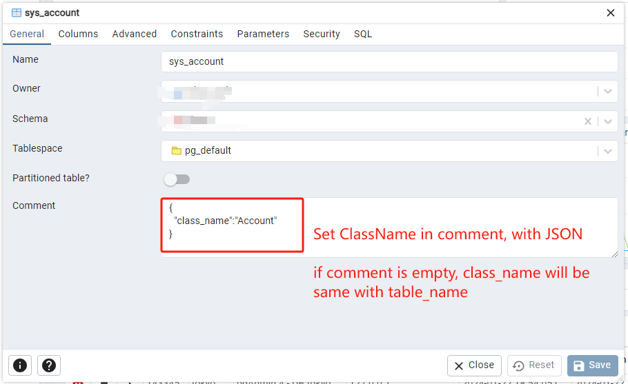

# pg2class
Generate NodeJS Class from Postgresql.  
> ⚠: this tool is experimental, be careful to use it in your project.   

## Installation  
`npm i -g pg2class`  

## Usage  
```shell-session  
$ pg2class -h
Usage: pg2class [options]

CLI tools to generate JS class from postgresql

Options:
  -V, --version               output the version number
  -c, --config [config.json]  path of configuration file, which includes sql connection parameter, in JSON format (default: "config.json")
  -o, --output-dir [output]   output directory (default: "output")
  -t, --table [data_table]    target table name, for all tables if not specifed
  --template [template]       specify your own template
  -h, --help                  display help for command
```

### Set custom class name  
You can set custom class name in table `Comment`
  

### Custom template  
for now, only 4 variables are used in a template:  
- `class_name`: `string`  
- `table_name`: `string`  
- `dt_fields`: `string array`  
- `comment`: `object`

```art
class {{ class_name }} {
    constructor(obj){
        {{each dt_fields }}this.{{$value.column_name}} = null;
        {{/each}}
        Object.assign(this, obj)
    }
}

module.exports = {
    {{class_name}}
}
```

### PG Connection  
```json
{
    "host": "localhost",
    "port": 5432,
    "user": "admin",
    "password": "password",
    "max": 10  // for pooling
}
```